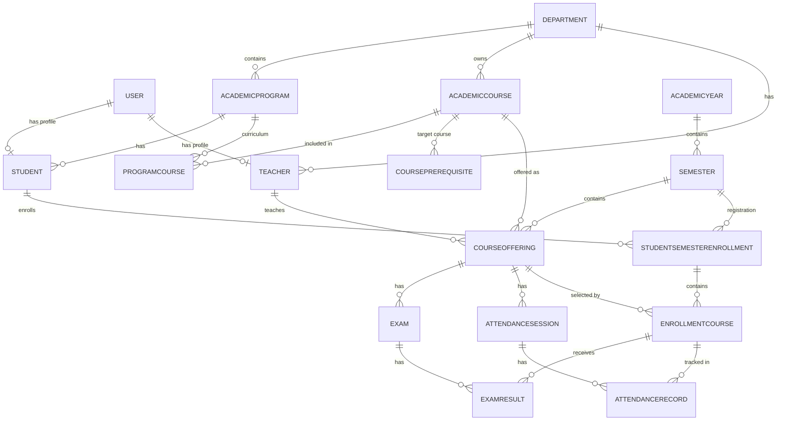

# University ERP

University ERP is a backend-focused university management system built with ASP.NET Core and Entity Framework Core.

This project models the academic core of a university ERP with a layered architecture, realistic enrollment rules, exam-based grading, GPA calculation, and attendance tracking.

## Tech Stack

- .NET 8
- ASP.NET Core Web API
- Entity Framework Core
- PostgreSQL
- JWT Authentication
- AutoMapper
- FluentValidation
- MailKit
- ClosedXML
- Swagger / OpenAPI

## Architecture

The solution is split into four projects:

- `src/UniversityERP.Domain`
  - entities
  - enums
  - pure domain layer without infrastructure dependencies

- `src/UniversityERP.Application`
  - `AppDbContext`
  - EF Core configurations
  - repository abstractions and implementations
  - persistence wiring

- `src/UniversityERP.Infrastructure`
  - DTOs
  - validators
  - AutoMapper profiles
  - business services
  - auth and email integrations

- `src/UniversityERP.API`
  - controllers
  - middleware
  - startup and dependency registration

## Design Choices

The project follows a layered approach inspired by Clean Architecture and Onion Architecture.

Main implementation choices:

- DTO-based API responses instead of exposing entities directly
- repository pattern for data access
- soft delete with `IsDeleted` and query filters
- thin controllers and business logic in services
- FluentValidation for request validation
- AutoMapper for entity/DTO mapping
- async/await across services and repositories
- role-based authorization

## Security and Auth

Implemented authentication and account features:

- JWT login
- role-based authorization
- login using university email or FIN code
- current user profile endpoint
- change own password
- reset user password
- activate and deactivate users
- protected role changes
- development-time SuperAdmin seeding

Supporting security details:

- hashed passwords with ASP.NET Core `PasswordHasher`
- issuer, audience, signing key, and expiration driven by configuration
- global exception middleware

## User and Identity Features

Implemented user management features:

- user CRUD
- paginated user listing
- search and filter by role and active status
- FIN code validation
- university email generation from FIN code
- optional personal email support
- university email uniqueness checks
- FIN uniqueness checks
- self-protection rules for delete and deactivate
- SuperAdmin protection rules

Excel import features:

- bulk user import from `.xlsx`
- row-level validation
- duplicate detection inside file and database
- generated university email creation
- temporary password generation
- import result summary with created and failed rows

Email features:

- SMTP integration through MailKit
- send credentials after user creation
- send credentials after Excel import
- send password reset notifications
- HTML email templates

## Academic Modules Implemented

### Academic Backbone

- Faculty
- Department
- Academic Program
- Academic Year
- Semester
- Student
- Teacher
- Academic Course

### Curriculum Layer

- `ProgramCourse`
  - links a course to a program
  - stores semester number
  - stores core/elective information

- `CoursePrerequisite`
  - models prerequisite relationships between courses

### Runtime Academic Layer

- `CourseOffering`
  - semester-time course instance
  - belongs to `AcademicCourse`
  - linked to semester and teacher
  - supports optional section

### Enrollment Layer

- `StudentSemesterEnrollment`
  - snapshot-based semester enrollment container
  - stores:
    - student
    - semester
    - academic program snapshot
    - student status snapshot
    - max credits snapshot
    - optional starting CGPA
    - draft/submitted state

- `EnrollmentCourse`
  - actual student enrollment into a course offering
  - stores:
    - attempt number
    - credit snapshot
    - final numeric score
    - letter grade
    - grade point

### Exams and Results

- `Exam`
  - exam type per course offering
  - midterm and final support
  - weighted grading structure

- `ExamResult`
  - numeric score per enrollment attempt per exam
  - used to calculate final attempt grade

### GPA

- semester GPA calculation
- cumulative GPA calculation
- GPA is derived from completed course attempts

### Attendance

- `AttendanceSession`
  - one session per course offering and date

- `AttendanceRecord`
  - present or absent record per enrolled student

## Business Rules Implemented

### Curriculum and Runtime Separation

The system explicitly separates academic design-time data from runtime semester data:

- `AcademicCourse` is the global course definition
- `ProgramCourse` is curriculum placement inside a program
- `CourseOffering` is the actual semester offering

### Enrollment Rules

Implemented enrollment rules include:

- semester must be active
- one semester enrollment per student per semester
- course offering must belong to the same semester as the semester enrollment
- duplicate course offering enrollment is blocked
- credit limit is enforced from semester snapshot
- prerequisite validation is enforced
- attempt number increases per student per academic course

### Grade and Completion Rules

Implemented grading rules include:

- one exam type per offering
- exam weight sum cannot exceed 100 percent
- one exam result per exam per student course attempt
- final numeric score is calculated from weighted exam results
- final letter grade is assigned from score
- grade point is assigned from letter/score mapping
- course attempt is marked completed when all required exam results exist and total exam weight is 100 percent

### Attendance Rules

Implemented attendance rules include:

- one attendance session per course offering and date
- one attendance record per session per enrolled student
- attendance can only be recorded for students enrolled in the same course offering
- dropped course enrollments cannot receive attendance records

## Grade Scale

Current fixed grade scale:

- `A` = `4.0`
- `A-` = `3.7`
- `B+` = `3.3`
- `B` = `3.0`
- `B-` = `2.7`
- `C+` = `2.3`
- `C` = `2.0`
- `C-` = `1.7`
- `D+` = `1.3`
- `D` = `1.0`
- `F` = `0.0`

## High-Level Data Model



## Main API Areas

The API currently exposes endpoints for:

- authentication
- account profile and password change
- users
- faculties
- departments
- academic programs
- academic years
- semesters
- students
- teachers
- academic courses
- program courses
- course prerequisites
- course offerings
- student semester enrollments
- enrollment courses
- exams
- exam results
- GPA
- attendance sessions
- attendance records

## How To Run The Project Locally

### Prerequisites

Install:

- .NET 8 SDK
- PostgreSQL

### Restore dependencies

From the repository root:

```powershell
dotnet restore .\UniversityERP.slnx
```

### Configure local secrets

Recommended secret strategy:

- `appsettings.json`
  - safe defaults only
- `appsettings.Development.json`
  - local non-sensitive settings only
- `.NET User Secrets`
  - local development secrets
- environment variables or `.env`
  - Docker and deployment secrets

### Suggested local development configuration

Initialize user secrets:

```powershell
dotnet user-secrets init --project .\src\UniversityERP.API\UniversityERP.API.csproj
```

Set database connection string:

```powershell
dotnet user-secrets set "ConnectionStrings:DefaultConnection" "Host=localhost;Port=5432;Database=UniversityERP;Username=postgres;Password=your_password" --project .\src\UniversityERP.API\UniversityERP.API.csproj
```

Set JWT configuration:

```powershell
dotnet user-secrets set "Jwt:Key" "your-long-random-secret-key" --project .\src\UniversityERP.API\UniversityERP.API.csproj
dotnet user-secrets set "Jwt:Issuer" "UniversityERP" --project .\src\UniversityERP.API\UniversityERP.API.csproj
dotnet user-secrets set "Jwt:Audience" "UniversityERP" --project .\src\UniversityERP.API\UniversityERP.API.csproj
dotnet user-secrets set "Jwt:ExpMinutes" "60" --project .\src\UniversityERP.API\UniversityERP.API.csproj
```

Set SMTP configuration:

```powershell
dotnet user-secrets set "Email:Host" "smtp.gmail.com" --project .\src\UniversityERP.API\UniversityERP.API.csproj
dotnet user-secrets set "Email:Port" "587" --project .\src\UniversityERP.API\UniversityERP.API.csproj
dotnet user-secrets set "Email:Username" "your_email@example.com" --project .\src\UniversityERP.API\UniversityERP.API.csproj
dotnet user-secrets set "Email:Password" "your_app_password" --project .\src\UniversityERP.API\UniversityERP.API.csproj
dotnet user-secrets set "Email:FromEmail" "your_email@example.com" --project .\src\UniversityERP.API\UniversityERP.API.csproj
dotnet user-secrets set "Email:FromName" "University ERP" --project .\src\UniversityERP.API\UniversityERP.API.csproj
dotnet user-secrets set "Email:UseStartTls" "true" --project .\src\UniversityERP.API\UniversityERP.API.csproj
```

Set university email domain:

```powershell
dotnet user-secrets set "UniversityEmail:Domain" "uni.edu.az" --project .\src\UniversityERP.API\UniversityERP.API.csproj
```

### Apply database migrations

```powershell
dotnet ef database update --project .\src\UniversityERP.Application\UniversityERP.Application.csproj --startup-project .\src\UniversityERP.API\UniversityERP.API.csproj --context AppDbContext
```

### Run the API

```powershell
dotnet run --project .\src\UniversityERP.API\UniversityERP.API.csproj
```

### Open Swagger

Swagger is enabled in development mode. Open the URL shown in the terminal, usually under `/swagger`.

## Docker and Deployment

The project is ready to be containerized.

Recommended deployment approach:

- API container for `UniversityERP.API`
- PostgreSQL container for the database
- environment variables for secrets and connection strings

Files to add next:

- `Dockerfile`
- `docker-compose.yml`

Suggested runtime configuration through environment variables:

- `ConnectionStrings__DefaultConnection`
- `Jwt__Key`
- `Jwt__Issuer`
- `Jwt__Audience`
- `Jwt__ExpMinutes`
- `Email__Host`
- `Email__Port`
- `Email__Username`
- `Email__Password`
- `Email__FromEmail`
- `Email__FromName`
- `Email__UseStartTls`
- `UniversityEmail__Domain`

### Run with Docker Compose

The repository includes:

- `Dockerfile`
- `docker-compose.yml`

You can start the API and PostgreSQL together with:

```powershell
docker compose up --build
```

The API will be available at:

```text
http://localhost:8080
```

### Docker environment variables

`docker-compose.yml` reads values from environment variables and supports a local `.env` file.

Recommended `.env` example:

```env
POSTGRES_DB=UniversityERP
POSTGRES_USER=postgres
POSTGRES_PASSWORD=your_postgres_password

JWT_KEY=your-long-random-jwt-secret
JWT_ISSUER=UniversityERP
JWT_AUDIENCE=UniversityERP
JWT_EXP_MINUTES=60

UNIVERSITY_EMAIL_DOMAIN=uni.edu.az

EMAIL_HOST=smtp.gmail.com
EMAIL_PORT=587
EMAIL_USERNAME=your_email@example.com
EMAIL_PASSWORD=your_app_password
EMAIL_FROM_EMAIL=your_email@example.com
EMAIL_FROM_NAME=University ERP
EMAIL_USE_STARTTLS=true
```

The `.env` file is already ignored by Git and should not be committed.

### Important note about migrations in Docker

The current setup starts the API and PostgreSQL containers, but database migrations still need to be applied.

You can apply them from the host machine:

```powershell
dotnet ef database update --project .\src\UniversityERP.Application\UniversityERP.Application.csproj --startup-project .\src\UniversityERP.API\UniversityERP.API.csproj --context AppDbContext
```

If you want, the next step after this can be adding a small migration helper workflow for Docker too.

## Current Scope Summary

Implemented:

- auth and JWT
- role-based access control
- account profile and password flows
- SMTP email notifications
- user CRUD and Excel import
- academic backbone
- curriculum modeling
- runtime course offering
- semester enrollment snapshots
- course enrollment with validation
- weighted exam structure
- exam results and final course grade calculation
- semester GPA
- cumulative GPA
- attendance tracking

Not implemented:

- finance and tuition
- stipend system
- advanced scheduling
- transcript generation
- dashboards and reporting UI

## Project Status

This repository represents a strong backend MVP for a University ERP focused on academic operations and system design correctness.

The main strength of the project is not only the number of modules, but the way academic concepts are separated and preserved:

- curriculum vs runtime offerings
- semester enrollment snapshots
- attempt-based course history
- prerequisite enforcement
- credit-limit enforcement
- exam-based final score calculation
- GPA derived from completed attempts
